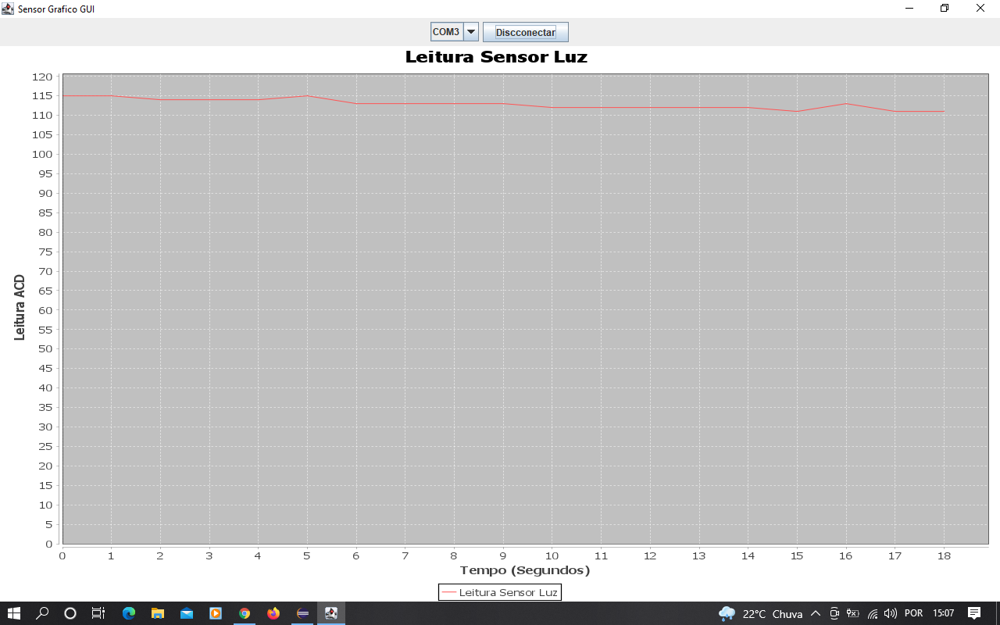

# Leitura-Sensor-Luz-Em-Java

Projeto criado para monitorar um sensor LDR ligado na porta analógica de um Arduino, enviando dados pela porta de comunicação USB e transformando estes dados em um gráfico linear em tempo real podendo ser monitorado com este programa criado em Java utilizando a biblioteca JFreeChart, onde em aplicações futuras pode ser incrementadas novas funções como alarmes acionamentos de atuadores. 

